# KaamEasy AI — System Capability & Architecture Report

> **Updated on**: June 2026
> **Project Root**: `d:\ServiceAI`
> **Brand**: KaamEasy AI (formerly "ServiceFlow AI")

---

## Overview

KaamEasy AI is a production-grade, double-sided **Agentic AI Service Booking Platform** (formerly branded as "ServiceFlow AI"). It enables customers to submit natural language service requests — in English, Urdu, or Roman Urdu — which are parsed by a multi-agent orchestration pipeline, ranked against nearby providers, and turned into a real-time, trackable booking with negotiation chat, live GPS, push notifications, and post-service follow-up.

This document records the **completed capabilities** (across backend, customer app, and provider app), the **secrets/credentials matrix**, the **current audit / phase status** (what was just shipped in the UI/UX overhaul + chat-pipeline fix), and the **remaining roadmap**.

---

## 1. Completed Capabilities (Pre-Overhaul) ✅

### 1.1 Backend — Multi-Agent DAG Orchestrator
A thread-safe multi-agent orchestrator built on FastAPI, composed of **7 specialized agents**:

| # | Agent | Purpose | Credentials | Status |
|---|---|---|---|---|
| 1 | **Intent Agent** | Parses natural language into structured JSON. Auto-resolves the user's location from their Firestore profile if not provided. | `GEMINI_API_KEY` | ✅ Active |
| 2 | **Provider Discovery Agent** | Locates providers near the target area via Google Places API, with a static-mock fallback. | `GOOGLE_MAPS_API_KEY` | ✅ Active |
| 3 | **Ranking Agent** | Scores and ranks providers by experience, rating, distance, and rate. Uses Gemini to generate a natural-language reasoning summary. | `GEMINI_API_KEY` | ✅ Active |
| 4 | **Booking Agent** | Pre-books the service, calculates the final cost, registers the booking as `pending`, and broadcasts it. | Firebase Service Account | ✅ Active |
| 5 | **Notification Agent** | Localizes status alerts and dispatches FCM push notifications. | Firebase Cloud Messaging | ✅ Active |
| 6 | **Follow-Up Agent** | Appends loyalty points and schedules satisfaction surveys. | Firebase Service Account | ✅ Active |
| 7 | **Provider Simulation Agent** | Background daemon for mock providers: auto-accepts → auto-confirms → streams GPS every 5s → arrives → works → completes. | Firebase Service Account | ✅ Active |

**Concurrency & resilience:** idempotency guard (mutex on duplicate submissions), LRU cache with TTL for ranked providers / agent logs, per-thread DAG caching, graceful agent-failure recovery, smart dispatch (real vs. mock providers), secrets hardening via `.gitignore` + `.easignore`.

### 1.2 Backend — Provider & Booking API Group

| Method | Endpoint | Auth | Description | Status |
|---|---|---|---|---|
| POST | `/api/v1/provider/register` | Firebase User | Register a provider profile linked to the caller's UID. | ✅ |
| GET | `/api/v1/provider/me` | Authenticated | Fetch the profile for the caller's UID. | ✅ |
| PUT | `/api/v1/provider/profile` | Authenticated | Update provider details. | ✅ |
| POST | `/api/v1/provider/status` | Provider | Toggle availability (`is_available`). | ✅ |
| POST | `/api/v1/provider/location` | Provider | Stream GPS (updates provider location + live booking tracking). | ✅ |
| GET | `/api/v1/provider/jobs` | Provider | Fetch active, broadcast, and assigned bookings. | ✅ |
| POST | `/api/v1/provider/jobs/{id}/accept` | Provider | Claim a broadcasted pending job. | ✅ |
| POST | `/api/v1/provider/jobs/{id}/respond` | Provider | Accept / decline a dispatched offer. | ✅ |
| POST | `/api/v1/provider/jobs/{id}/status` | Provider | Update job status (`on_the_way` → `arrived` → `in_progress` → `completed`). | ✅ |
| POST | `/api/v1/{booking_id}/chat` | User / Provider | Append a chat message; backend derives the sender UID from the bearer token. | ✅ |
| POST | `/api/v1/{booking_id}/confirm` | Provider | Finalize the negotiated scheduled time. | ✅ |

### 1.3 Customer Mobile Client (`mobile`, Expo SDK 54)
Email + password auth with background email-verification polling; GPS-based profile onboarding with reverse-geocoding; bottom-tab navigation; intent-extraction chat with confidence ring and service quick-picks; ranked provider list; booking-success / dispatch wait state; real-time negotiation chat; live map tracking with `react-native-maps`; AI agent reasoning trace viewer.

### 1.4 Provider Mobile Client (`mobile-provider`, Expo SDK 56)
Firebase auth + email verification; profile onboarding & edit; dashboard with online/offline toggle, earnings, and jobs counter; scrollable jobs board with countdown timers; job detail view with status progression; negotiation chat with time-picker; live map tracking; GPS streaming hook (`useGPSTracking`); earnings & history.

---

## 2. Phase 1–4 Audit — Just Shipped ✅

A complete audit (`SERVICEFLOW_PLAN.md`) and a 5-phase implementation closed out the highest-impact bugs, functional gaps, and de-clutter work. **All Phases 1–4 are now complete and verified.**

### Phase 1 — Build Blockers & Critical Bugs (`C1`–`C11`) ✅
- `mobile/tsconfig.json` build-blocker fixed.
- Backend discovery-agent crash wrapped; simulation path now writes customer data.
- Empty-list guards in `ranking_agent` and `workflow`.
- Required body in `/provider/jobs/...` endpoints.
- Operator-precedence bug in `firebase_db.py` service matching.
- Hooks-before-early-return in `DashboardScreen`.
- `EarningsScreen` linear-gradient removed.
- `useEarnings` 0/0 NaN guard.
- Stale-error Alert in Register / VerifyEmail.
- Chat sender IDs sourced from `auth.currentUser?.uid` (initial pass — the chat pipeline was further hardened in the UI overhaul, see §3).

### Phase 2 — Functional Correctness (`H1`–`H8`) ✅
- `bookService` now passes the FCM token so the backend can push.
- FCM token registered with the backend on app boot in the provider app.
- Job-accept path unified on `respondToJob(id, 'accept')`.
- Chat writes routed through the backend (`POST /v1/bookings/{id}/chat`); Firestore remains the realtime read layer.
- `BookingHistoryScreen` now orders by `created_at desc` with a fallback for missing composite index.
- `status_pending` style added to JobsScreen.
- `useGPSTracking` hook deps fixed so changing `bookingId` re-streams.
- All `/provider/*` and booking routes verify Firebase auth + token-owned `provider_id`.

### Phase 3 — UI/UX Overhaul (`X1`–`X11`) ✅
- SafeAreaView / useSafeAreaInsets standardized across the provider app and most customer screens (the remaining gaps are closed in §3 / §5).
- Long-list overflow fixed with ScrollView + RefreshControl.
- Dead buttons wired (Call Customer, View Details, Support).
- Provider tokens module reused across the app.
- Customer `StatusBadge` / `ProgressSteps` (the new primitives — see §3.1).
- Typography hierarchy tightened (tiny 10–11px labels removed in the new code).
- Empty / loading / error states standardized.
- Map-in-ScrollView gesture conflict isolated.
- Decline confirmation + 60s request countdown on `JobRequestModal`.
- Consistent back-navigation after `navigation.reset` chains.

### Phase 4 — Code Quality (`Q1`–`Q4`) ✅
- Dead code removed: ~190 dead styles from customer `LiveTrackingScreen`; orphan `mobile-provider/src/app/explore.tsx`; dead `AgentLogsResponse` import.
- Typed navigation across 5 customer screens.
- Backend error-message hygiene (`detail=str(exc)` → safe generic messages).
- Effect-dependency correctness on `BookingHistoryScreen`.

### Phase 5 — Feature Backlog (deferred) ⏳
F1 multi-provider broadcast, F2 ranked-fallback re-assignment, F3 Firestore-transaction accept race, F4 loyalty/survey payloads, F5 in-app "your booking was accepted" banner. **Not in this milestone.**

> The Phase 5 *de-clutter portion* (UI/UX polish backlog, dead-code follow-up, branding cleanup) is documented separately in §5.1–5.3 as **Shipped ✅**.

---

## 3. UI/UX Premium Overhaul & Chat Pipeline Fix — Just Shipped ✅

A targeted UI/UX pass plus a complete rewrite of the chat pipeline. Two distinct brand tokens, a shared primitive library, and a corrected `auth.currentUser.uid` flow.

### 3.1 New Design System

**Branding:** `mobile/app.json` → `expo.name = "KaamEasy AI"`, `mobile-provider/app.json` → `expo.name = "KaamEasy Provider"`. Slugs, bundle IDs, and Firebase project IDs left intact to avoid breaking existing builds.

**Theme tokens** (identical shape, distinct hex values per app):
- `mobile/src/constants/theme.ts` (new) — indigo-led dark palette (`#6366f1` primary), state-tinted variants.
- `mobile-provider/src/constants/theme.ts` (extended) — cyan-led dark palette (`#00bfff` primary) with the same `state.*` soft-tinted variants for badges.

Each theme exposes: `AppColors` (bg, surface, surface2, overlay, border, borderSubtle, primary, success, warning, danger, info, textPrimary/Secondary/Muted/Disabled, `state.success/warning/danger/info/neutral.{bg,text,border}`), `Spacing`, `Radius`, `FontWeight`, `Typography` (caption → display), `Shadow`, `Fonts`.

**Shared primitives** (10 new files, 5 per app):
- `StatusBadge` — soft-tinted pill mapping `StatusKey → state.*` token, sizes `sm`/`md`.
- `ProgressSteps` — horizontal step indicator with `steps`, `current`, `color`.
- `EmptyState` — centered icon + title + optional body + optional CTA.
- `QuickSuggestions` — horizontal chip rail of pre-canned reply suggestions.
- `ChatBubble` — system pill / provider-customer bubble with corner-asymmetric radius.

### 3.2 Chat Pipeline Fix (the original bug)

The customer + provider chat screens previously fell back to a literal role string (`"customer"` / `"provider"`) when `auth.currentUser?.uid` was absent, silently mis-attributing every message. **Fixed end to end:**

| Layer | Before | After |
|---|---|---|
| Service signature | `sendChatMessage(bookingId, sender, text, senderType)` | `sendChatMessage(bookingId, text, senderType)` — `sender` removed; backend derives the UID from the bearer token. |
| `currentUserId` source | `auth?.currentUser?.uid || currentUserRole` (silent role-string fallback) | `auth?.currentUser?.uid` only; if null the send button is disabled and an inline error is rendered. |
| `POST /v1/bookings/{id}/chat` body | included `sender: <string>` | body is `{ sender_type, text }` only. |
| Send state | none | `sending` disables the send button + shows spinner; `sendError` displays inline; typed text is restored on failure for retry. |
| Auto-scroll | none | `flatListRef.current?.scrollToOffset({ offset: 0 })` on `messages.length` change. |
| Empty chat | emoji wall of text | `<EmptyState>` with icon + title + body. |
| Safe area | raw `<View>` + hardcoded `paddingTop` | `<SafeAreaView edges={['top','bottom']}>` (customer) and provider equivalent. |

### 3.3 Refactored Surfaces

| File | What changed |
|---|---|
| `mobile/src/screens/ChatScreen.tsx` | Full rewrite — SafeAreaView, auth-uid, sending/error state, StatusBadge, ChatBubble, QuickSuggestions, EmptyState, auto-scroll, auto-navigate timer properly cleared on unmount. |
| `mobile/src/components/ui/NegotiationChatSheet.tsx` | Full rewrite — SafeAreaView, same auth-uid / sending / error / auto-scroll fixes, EmptyState, ChatBubble, QuickSuggestions. |
| `mobile-provider/src/screens/ChatScreen.tsx` | Full rewrite — SafeAreaView, same auth-uid / sending / error fixes, StatusBadge, ChatBubble, EmptyState, QuickSuggestions. The old `+` action menu is gone — replaced by a single inline chip rail. The "Custom time" modal is replaced by an inline time-picker sheet anchored to the "Confirm" header button. |

### 3.4 Dead-Code Cleanup
- `app-tabs.web.tsx` — removed stale `href="/explore"` block (was failing the `typedRoutes` experiment).
- `app-tabs.tsx` — same Explore tab removed for consistency (file is itself unused starter code; flagged for deletion in a follow-up).

### 3.5 Verification
```
mobile/             tsc --noEmit → 0 errors  ✅
mobile-provider/    tsc --noEmit → 0 errors  ✅
```
No new dependencies introduced. The customer app is on TypeScript 5.9; the provider app is on TypeScript 6.0.

---

## 4. Secrets & API Keys Matrix

```
                ┌──────────────────────────────────────┐
                │ Customer / Provider Mobile Client App│
                └──────────────────┬───────────────────┘
                                   │
       ┌───────────────────────────┼────────────────────────────┐
       ▼                           ▼                            ▼
[ Firebase Auth / DB ]      [ Google Maps API ]        [ KaamEasy AI Backend ]
 (Web Config JSON)           (Reverse Geocoding)         (FastAPI Endpoint)
                                                                  │
                              ┌───────────────────────────────────┼────────────────────────┐
                              ▼                                   ▼                        ▼
                    [ GEMINI_API_KEY ]                [ GOOGLE_MAPS_API_KEY ]      [ Firebase Admin ]
                     (Intent & Ranking)                 (Discovery Distance Matrix)  (FCM Push & DB)
```

---

## 5. Remaining Work 🔄

> **Phase 5 de-clutter portion (5.1, 5.2, 5.3) — Just Shipped ✅**
> The UI/UX polish backlog, dead-code follow-up, and brand rename are now complete.
> The only remaining items are production hardening and feature backlog (5.4, 5.5).

### 5.1 Phase 3 de-clutter backlog (UI/UX polish) — Shipped ✅
The seven screens marked in the Phase 3 audit have all been refactored to the new design system.

| Screen | Refactor applied |
|---|---|
| `mobile/src/screens/BookingHistoryScreen.tsx` | Inline `getStatusStyle()` + `statusBadge` view → shared `<StatusBadge>`; wrapped in `SafeAreaView` (top edge); all hex strings → `AppColors` / `Spacing` / `Radius`; tiny 10–11px modal text bumped to 12+. |
| `mobile/src/screens/BookingSuccessScreen.tsx` | The four `pillGreen`/`pillBlue`/`pillPurple`/`pillAmber` style objects → single live `<StatusBadge status={currentStatus} size="md" />`; dropped `paddingTop: Platform.OS === 'ios' ? 70 : 50` (SafeAreaView handles it); all hex → theme tokens. |
| `mobile/src/screens/LiveTrackingScreen.tsx` | Wrapped in `SafeAreaView`; hand-rolled `<View style={styles.statusFlow}>` with 5 dots + connectors → shared `<ProgressSteps steps={STATUS_STEPS} current={...} />`; status colors from `AppColors.state.*`; paddingTop hack removed. |
| `mobile-provider/src/screens/DashboardScreen.tsx` | Hardcoded hex → `AppColors` / `Spacing` / `Radius` / `FontWeight` tokens; the "no jobs" state now uses shared `<EmptyState>`; 10–11px fonts bumped to 12+. |
| `mobile-provider/src/screens/JobsScreen.tsx` | Six `status_*` style objects → shared `<StatusBadge>`; raw "Coords" lat/lng row removed from each job card (lat/lng still surfaces in the detail view); all hex → theme tokens; tiny 10–11px fonts → 12+. |
| `mobile-provider/src/screens/JobDetailScreen.tsx` | Header status badge → shared `<StatusBadge>`; the hand-rolled `<View style={styles.statusFlow}>` with 5 dots + connectors → shared `<ProgressSteps>`; all hex → theme tokens; tiny 10–11px fonts → 12+. |
| `mobile-provider/src/screens/JobHistoryScreen.tsx` | All hex → theme tokens; 10–11px text → 12+; earnings card now uses theme tokens; status indicators use shared primitives. |

Verification: `tsc --noEmit` clean in both `mobile/` and `mobile-provider/`.

### 5.2 Dead-code follow-up — Shipped ✅
- `mobile-provider/src/components/app-tabs.tsx` and `app-tabs.web.tsx` — **deleted**. Neither file is imported anywhere; the provider app navigates exclusively via the `Stack` in `src/app/_layout.tsx`.
- `assets/images/tabIcons/home.png` — **no longer referenced**. The `tabIcons/` directory does not exist in the working tree, so no orphaned asset remains.
- The dead `Home` tab trigger and Explore tab in the `app-tabs.*` files are gone with the files themselves.

### 5.3 Branding cleanup (root + docs) — Shipped ✅
- `mobile/src/screens/HomeScreen.tsx:190` — `brandTag = "KaamEasy AI"` ✅
- `mobile/src/navigation/MainTabNavigator.tsx:88` — `title: 'KaamEasy AI'` ✅ (the React Navigation source of the "tab title reverts" bug)
- `mobile/src/screens/LoginScreen.tsx:161` — brand text → `"KaamEasy AI"` ✅
- `mobile-provider/src/screens/RegisterScreen.tsx:86` — `title: 'Join KaamEasy'` ✅
- `mobile-provider/src/screens/ProfileScreen.tsx` — `support@serviceflow.ai` / `serviceflow.ai` references removed ✅
- `mobile-provider/src/services/providerAPI.ts` and `mobile-provider/src/constants/theme.ts` — JSDoc references to "ServiceFlow" removed ✅
- `mobile/App.tsx` — added `document.title = 'KaamEasy AI'` on web so the browser tab title no longer reverts to "ServiceFlow AI" 1–2 s after load.
- `mobile/.env.example` — comment header updated ✅
- Root-level docs: `README.md`, `quickstart.md`, `SERVICEFLOW_PLAN.md`, `PROVIDER_APP_COMPLETE.md`, `backend/README.md` — all retitled to KaamEasy ✅
- **Backend (Python) brand**:
  - `backend/app/core/config.py` — `PROJECT_NAME = "KaamEasy AI"` ✅
  - `backend/app/agents/followup_agent.py` — `"🎉 You earned 50 KaamEasy points! …"` ✅
  - `backend/app/agents/provider_simulation_agent.py` — push title `"KaamEasy AI — Booking Update"` and thank-you message ✅
  - `backend/app/orchestrator/workflow.py` — DAG name `kaameasy_booking_pipeline`; module docstring ✅
  - `backend/app/api/v1/provider.py` — module docstring ✅
  - 14 backend loggers renamed from `getLogger("serviceflow")` → `getLogger("kaameasy")` ✅

**Deliberately retained** (would break existing builds / Firebase projects):
- `package.json` `name` fields (npm internal name, not user-facing).
- `slug`, `bundleIdentifier`, `package`, Firebase `project_id` / `package_name` — these are tied to the live Firebase project and Apple/Google credentials; renaming them requires a new Firebase project + new build pipeline.
- `system_capability.md` itself still uses "formerly ServiceFlow AI" in §1's brand banner, which is intentional historical context.

### 5.4 Production / Deployment Backlog (carry-over)
1. **Production Push Notifications Credential Hardening** — `fcm_service.py` works; production APNs + FCM certs not yet configured.
2. **CI/CD Pipelines** — manual builds only; no GitHub Actions / EAS auto-builds.
3. **Scalable Cloud Deployment** — FastAPI runs locally; no Docker, no Cloud Run / ECS.
4. **Payment Gateway Integration** — payouts are estimated only; no Stripe / Braintree / local processor.
5. **Turn-by-Turn GPS Navigation** — straight-line distance only; no Directions API / Mapbox Navigation.

### 5.5 Feature Backlog (Phase 5, low priority)
F1 multi-provider broadcast, F2 ranked-fallback re-assignment, F3 Firestore-transaction accept race, F4 loyalty/survey payloads, F5 in-app "your booking was accepted" banner.

---

## 6. Double-Sided Marketplace System Interaction

```mermaid
sequenceDiagram
    autonumber
    actor Customer as Customer App
    participant Backend as FastAPI Server
    participant DB as Firestore Database
    actor Provider as Provider App

    Customer->>Backend: 1. Send natural language request
    Backend->>Backend: Run Intent, Discovery, and Ranking Agents
    Backend-->>Customer: 2. Show ranked list of providers
    Customer->>Backend: 3. Book selected Provider
    Backend->>DB: 4. Create Booking (Status: "pending")
    Backend->>Provider: 5. Send FCM Notification (Broadcast Job Available)
    
    rect rgb(20, 40, 60)
        Note over Customer, Provider: Real Provider Negotiation Flow
        Provider->>Backend: 6a. Claim Broadcast Job (/jobs/{id}/accept)
        Backend->>DB: 7a. Lock Provider & Update Status ("accepted")
        Customer->>Backend: 8a. Exchange chat messages (/bookings/{id}/chat)
        Provider->>Backend: 8b. Exchange chat messages & propose timing
        Provider->>Backend: 9a. Confirm timing (/bookings/{id}/confirm)
        Backend->>DB: 10a. Update Booking (Status: "confirmed", scheduled_time)
        Provider->>DB: 11a. Stream GPS Location via useGPSTracking (every 10s)
        Provider->>Backend: 12a. Update Status ("on_the_way" -> "arrived" -> "in_progress" -> "completed")
    end

    rect rgb(60, 20, 20)
        Note over Backend, DB: Simulation Flow (For Mock Providers)
        Backend->>Backend: 6b. Spawn Background Simulation Thread
        Backend->>DB: 7b. Auto-confirm timing & transition status ("confirmed")
        Backend->>DB: 8c. Interpolate simulated GPS coordinates & advance statuses
    end

    DB-->>Customer: 13. Listen to status & live coordinates in real-time
    Customer->>Customer: 14. Render chat / live provider marker moving on Map
```



---

## 7. Status Legend

| Symbol | Meaning |
|---|---|
| ✅ | Shipped and verified (tsc clean, end-to-end tested) |
| 🔄 | In progress / partially done |
| ⏳ | Backlog, deferred |
| ❌ | Blocked / not started |
