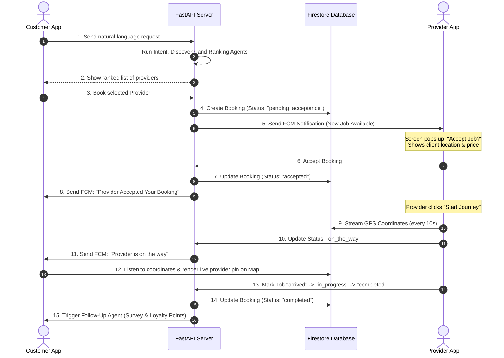

# ServiceFlow AI — System Capability & Architecture Report

> **Updated on**: June 2026
> **Project Root**: `d:\ServiceAI`

---

## Overview

ServiceFlow AI is an **Agentic AI Service Booking Platform**. A user enters a natural language service request (English, Urdu, or Roman Urdu), and a multi-agent orchestration pipeline (powered by Google Labs Antigravity) processes it: extracting intent, discovering and ranking nearby providers, establishing a real-time booking, triggering push notifications, and scheduling loyalty follow-ups.

This document details the completed capabilities, outstanding tasks, and a comprehensive architectural blueprint for the proposed **Service Provider Application** (mobile client).

---

## 1. Current System Capabilities (Completed) ✅

### 1.1 Backend — Multi-Agent DAG Orchestrator
The backend operates a thread-safe multi-agent orchestrator built on top of FastAPI and Google Labs Antigravity, comprised of **6 specialized agents**:

| # | Agent | Purpose & Capability | Credentials / Keys Used | Status |
|---|---|---|---|---|
| 1 | **Intent Agent** | Parses natural language inputs (English, Urdu, Roman Urdu) into structured JSON. If the user doesn't specify a location, it automatically resolves it using their Firestore profile coordinates. | `GEMINI_API_KEY` | ✅ Active |
| 2 | **Provider Discovery Agent** | Locates service professionals from Firestore (or mock fallback). Calculates precise road distance and travel times. | `GOOGLE_MAPS_API_KEY` | ✅ Active |
| 3 | **Ranking Agent** | Scores and ranks matching providers. Uses Gemini to formulate a personalized natural-language explanation of why the top provider was chosen. | `GEMINI_API_KEY` | ✅ Active |
| 4 | **Booking Agent** | Confirms booking, generates transaction ID (`SFW-XXXXXX`), calculates ETAs, estimates final cost, and registers it in Firestore. | Firebase Service Account | ✅ Active |
| 5 | **Notification Agent** | Localizes status alerts into English/Urdu/Roman Urdu, and fires push notifications to registered devices. | Firebase Cloud Messaging (FCM) | ✅ Active |
| 6 | **Follow-Up Agent** | Appends customer loyalty points and schedules feedback surveys. | Firebase Service Account | ✅ Active |

#### Performance and Concurrency Features:
- **Idempotency Guard**: Prevents duplicate concurrent booking submissions for the same transaction using a mutex lock.
- **LRU Caching with TTL**: Caches ranked provider results and agent logs in memory to reduce Firestore read volume, with active removal of expired items.
- **DAG Caching**: Caches execution graphs per thread to avoid re-creation overhead.

---

### 1.2 Mobile Client — React Native & Expo (Tailwind CSS / NativeWind)
The customer app is fully authenticated and styled with a premium glassmorphic dark-mode palette:

| Screen / Module | Implemented Features |
|-----------------|----------------------|
| **Authentication Flow** | Email and password login/signup with real-time background email-verification polling (every 3 seconds) and resend cooldown limits. |
| **Profile Onboarding** | GPS-based profile configuration screen (`LocationProfileScreen`). Integrates Google Maps Reverse Geocoding to auto-fill address, city, and province from device coordinates. |
| **Main Tabs & Navigation** | Bottom tab navigation containing **Home** (AI Search), **Bookings** (History), and **Profile** (Settings). |
| **Search & Extraction** | Interactive chat interface. Displays extracted intent with a custom confidence percentage ring and service category quick-picks. |
| **Provider Selection** | Lists discovered providers with experience chips, rating stars, distance and hourly rates, and AI reasoning quotes. Integrates skeleton loaders. |
| **Booking Confirmation** | Celebratory screen showing ETA, cost, confirmation code, and booking status. |

---

## 2. Secrets & API Keys Matrix

Here is how credentials are distributed across the system architecture:

```
                  ┌──────────────────────┐
                  │   Mobile Client App  │
                  └──────────┬───────────┘
                             │
     ┌───────────────────────┼────────────────────────┐
     ▼                       ▼                        ▼
[ Firebase Auth / DB ] [ Google Maps API ]    [ ServiceAI Backend ]
 (Web Config JSON)      (Reverse Geocoding)     (FastAPI Endpoint)
                                                      │
                       ┌──────────────────────────────┼────────────────────────┐
                       ▼                              ▼                        ▼
               [ GEMINI_API_KEY ]            [ GOOGLE_MAPS_API_KEY ]    [ Firebase Admin ]
                (Intent & Ranking)            (Discovery Distance Matrix)   (FCM Push & DB)
```

---

## 3. What is Remaining (Future Roadmap) ❌

1. **Integrate the Agent Log Viewer UI (Written but Unused)**:
   - **Current State**: The component `AgentLogViewer.tsx` has been fully implemented in `mobile/src/components/`, but is **not imported or mounted** on any screen.
   - **Action**: Render it on the searching/booking state screens (like `ProvidersScreen` or `BookingSuccessScreen`) to show real-time agent reasoning step logs directly to the user.
2. **Real-Time Map Tracking**:
   - **Current State**: The UI indicates "On the way" and includes placeholder widgets, but lacks live coordinate plotting.
   - **Action**: Implement `react-native-maps` to draw route lines from the provider's active coordinates to the user's home coordinates on the booking status details screen.
3. **EAS Build Secret Hardening**:
   - **Current State**: Environment variables are kept locally in `.env` configuration files.
   - **Action**: Configure Expo Application Services (EAS) credential store to securely inject variables during cloud builds.

---

## 4. Architectural Blueprint: Separate Provider Application 📱

To evolve the platform from static, mock service providers to a **live, double-sided marketplace**, we can build a separate mobile client app for **Service Providers** (plumbers, electricians, cleaners, etc.). 

Below is the blueprint for the provider app and the required system updates.

### 4.1 System Interaction Diagram (Double-Sided Marketplace)



---

### 4.2 Database Schema Updates (Firestore)

#### 1. `providers` (Updated)
Store live state, current location, and verification details of registered providers:
```json
{
  "provider_id": "PROV-998877",
  "name": "Arsalan Khan",
  "phone": "+923001234567",
  "service": "AC Technician",
  "hourly_rate": 1500,
  "experience_yrs": 5,
  "rating": 4.8,
  "is_verified": true,
  "is_available": true,
  "current_coordinates": {
    "latitude": 33.6844,
    "longitude": 73.0479
  },
  "fcm_token": "fcm_token_here_for_dispatching",
  "updated_at": "2026-06-11T00:20:00Z"
}
```

#### 2. `bookings` (Updated)
Add real-time provider movement coordinates and status logs:
```json
{
  "booking_id": "SFW-112233",
  "user_id": "USER-4455",
  "provider_id": "PROV-998877",
  "status": "on_the_way", // pending_intent -> searching -> ranking -> pending_acceptance -> accepted -> on_the_way -> arrived -> in_progress -> completed
  "scheduled_at": "ASAP",
  "user_coordinates": {
    "latitude": 33.6515,
    "longitude": 73.0812
  },
  "provider_live_coordinates": {
    "latitude": 33.6702,
    "longitude": 73.0610
  },
  "total_estimated_cost": 3000,
  "eta_minutes": 15
}
```

---

### 4.3 Backend API Extensions (FastAPI)

We will introduce a `/provider` route group:

| Method | Endpoint | Authorized As | Description |
|---|---|---|---|
| **POST** | `/api/v1/provider/register` | Unauthenticated | Create a provider profile (name, service, rate, skills). |
| **POST** | `/api/v1/provider/status` | Provider | Toggle availability (`is_available: true/false`). |
| **POST** | `/api/v1/provider/location` | Provider | Stream current coordinates (streams from mobile background service). |
| **GET** | `/api/v1/provider/jobs` | Provider | List assigned pending or active bookings. |
| **POST** | `/api/v1/provider/jobs/{booking_id}/respond` | Provider | Accept or reject a booking request. |
| **POST** | `/api/v1/provider/jobs/{booking_id}/status` | Provider | Update job status (`on_my_way` \| `arrived` \| `in_progress` \| `completed`). |

---

### 4.4 Provider Application Screens Flow

The provider client will be built as a separate Expo React Native application (`mobile-provider`), sharing the same UI library, Tailwind styles, and state management structure:

1. **Dashboard / Home Screen**:
   - Availability toggle switch (Go Online / Go Offline).
   - Earnings overview card (Daily/Weekly earnings, jobs completed).
   - "Ready for Jobs" pulsing radar animation indicating search mode.
2. **Incoming Booking Request overlay**:
   - High-priority modal screen that overrides the dashboard upon receiving an FCM booking dispatch.
   - Displays: Service type, distance to client, estimated payout, and customer reviews.
   - Large interactive Slide-to-Accept slider and a Decline button.
3. **Active Job & Navigation Screen**:
   - Integrates Google Maps routing showing the shortest road path to the client's home address.
   - Big CTA buttons that transition states sequentially:
     - **Slide to Start Journey** (Updates booking status to `on_the_way` -> triggers customer alert).
     - **I Have Arrived** (Updates booking status to `arrived` -> rings customer's device).
     - **Start Work** (Updates status to `in_progress` -> starts stopwatch/timer).
     - **Complete Job** (Updates status to `completed` -> triggers follow-up agent).
4. **Earnings & History Screen**:
   - Detailed list of completed jobs, hours worked, tips, and customer feedback surveys.
5. **Profile & Skill Management**:
   - Verification documents upload screen (CNIC, certificates).
   - Rate adjuster (set custom hourly rates) and service categories settings.
