```mermaid
sequenceDiagram
    autonumber
    actor Customer as Customer App
    participant Backend as FastAPI Server
    participant DB as Firestore Database
    actor Provider as Provider App

    Customer->>Backend: 1. Send natural language request
    Backend->>Backend: Run Intent, Discovery, and Ranking Agents
    Backend-->>Customer: 2. Show ranked list of providers
    Customer->>Backend: 3. Book selected Provider
    Backend->>DB: 4. Create Booking (Status: "pending")
    Backend->>Provider: 5. Send FCM Notification (Broadcast Job Available)
    
    rect rgb(20, 40, 60)
        Note over Customer, Provider: Real Provider Negotiation Flow
        Provider->>Backend: 6a. Claim Broadcast Job (/jobs/{id}/accept)
        Backend->>DB: 7a. Lock Provider & Update Status ("accepted")
        Customer->>Backend: 8a. Exchange chat messages (/bookings/{id}/chat)
        Provider->>Backend: 8b. Exchange chat messages & propose timing
        Provider->>Backend: 9a. Confirm timing (/bookings/{id}/confirm)
        Backend->>DB: 10a. Update Booking (Status: "confirmed", scheduled_time)
        Provider->>DB: 11a. Stream GPS Location via useGPSTracking (every 10s)
        Provider->>Backend: 12a. Update Status ("on_the_way" -> "arrived" -> "in_progress" -> "completed")
    end

    rect rgb(60, 20, 20)
        Note over Backend, DB: Simulation Flow (For Mock Providers)
        Backend->>Backend: 6b. Spawn Background Simulation Thread
        Backend->>DB: 7b. Auto-confirm timing & transition status ("confirmed")
        Backend->>DB: 8c. Interpolate simulated GPS coordinates & advance statuses
    end

    DB-->>Customer: 13. Listen to status & live coordinates in real-time
    Customer->>Customer: 14. Render chat / live provider marker moving on Map
```

# ServiceFlow AI — System Capability & Architecture Report

> **Updated on**: June 2026
> **Project Root**: `d:\ServiceAI`

---

## Overview

ServiceFlow AI is a production-grade, double-sided **Agentic AI Service Booking Platform**. It enables users to submit natural language service requests (in English, Urdu, or Roman Urdu), which are then analyzed and fulfilled by a multi-agent orchestration pipeline. The pipeline extracts the customer's intent, discovers and ranks nearby providers, establishes a real-time booking, sends push notifications, and triggers loyalty and feedback workflows.

This document details the completed capabilities, secrets/credentials matrix, unified architectural blueprint, and the remaining roadmap of the double-sided marketplace.

---

## 1. Current System Capabilities (Completed) ✅

### 1.1 Backend — Multi-Agent DAG Orchestrator
The backend operates a thread-safe multi-agent orchestrator built on FastAPI and Google Labs Antigravity, comprised of **7 specialized agents**:

| # | Agent | Purpose & Capability | Credentials / Keys Used | Status |
|---|---|---|---|---|
| 1 | **Intent Agent** | Parses natural language inputs (English, Urdu, Roman Urdu) into structured JSON. If the user doesn't specify a location, it automatically resolves it using their Firestore profile coordinates. | `GEMINI_API_KEY` | ✅ Active |
| 2 | **Provider Discovery Agent** | Locates service professionals near the target area. Connects to the Google Places API for real-world business lookup, with a robust fallback to static mock providers in case the API key is missing or yields no results. | `GOOGLE_MAPS_API_KEY` | ✅ Active |
| 3 | **Ranking Agent** | Scores and ranks matching providers based on experience, rating, distance, and rate. Uses Gemini to formulate a personalized natural-language explanation of why the top provider was chosen. | `GEMINI_API_KEY` | ✅ Active |
| 4 | **Booking Agent** | Pre-books the service, calculates final estimated costs, registers the booking as `pending` (broadcast state), and broadcasts it to matching providers. | Firebase Service Account | ✅ Active |
| 5 | **Notification Agent** | Localizes status alerts into English/Urdu/Roman Urdu, and fires push notifications to registered devices via Firebase Cloud Messaging. | Firebase Cloud Messaging (FCM) | ✅ Active |
| 6 | **Follow-Up Agent** | Appends customer loyalty points to their profile and schedules satisfaction surveys. | Firebase Service Account | ✅ Active |
| 7 | **Provider Simulation Agent** | Spawns as a background daemon thread after booking creation for mock providers. Simulates a real provider lifecycle: auto-accepts the job -> auto-confirms negotiation -> streams GPS coordinates toward the customer every 5 seconds → arrives → starts work → completes. Each status change writes to Firestore and the agent trace log in real-time. | Firebase Service Account | ✅ Active |

#### Performance and Concurrency Features:
*   **Idempotency Guard**: Rejects duplicate concurrent booking submissions for the same transaction using a mutex lock.
*   **LRU Caching with TTL**: Caches ranked provider results and agent logs in memory to reduce Firestore read volume, with active removal of expired items.
*   **DAG Caching**: Caches execution graphs per thread to avoid re-creation overhead.
*   **Error Recovery**: Agent failures are caught and logged gracefully, allowing the pipeline to proceed or return fallback responses without crashing.
*   **Smart Dispatching & Broadcast**: Orchestrator dynamically differentiates between real online providers (who receive live FCM push alerts and pull jobs from a broadcast list) and mock API providers (who automatically trigger the daemon simulation).
*   **Secrets Hardening**: Credentials, `.env` files, `.easignore`, and Apple/Google certificates are tightly ignored from version control to prevent exposure.

---

### 1.2 Backend — Provider & Booking API Group
We have implemented and verified a full suite of API routes in the FastAPI backend under the `/provider` and `/bookings` path groups to support real provider app integration and state machine transitions:

| Method | Endpoint | Authorized As | Description | Status |
|---|---|---|---|---|
| **POST** | `/api/v1/provider/register` | Firebase User | Registers a new provider profile associated with the authenticated Firebase UID. | ✅ Active |
| **GET** | `/api/v1/provider/me` | Authenticated | Fetches the provider profile details linked to the current user's Firebase UID. | ✅ Active |
| **PUT** | `/api/v1/provider/profile` | Authenticated | Updates provider profile details (Name, Phone, Service, Hourly Rate, Experience). | ✅ Active |
| **POST** | `/api/v1/provider/status` | Provider | Toggles provider availability (`is_available` true/false) in Firestore. | ✅ Active |
| **POST** | `/api/v1/provider/location` | Provider | Streams current GPS coordinates (updates both provider location & live booking tracking). | ✅ Active |
| **GET** | `/api/v1/provider/jobs` | Provider | Retrieves active, broadcasted (`pending`), and assigned bookings matching the provider. | ✅ Active |
| **POST** | `/api/v1/provider/jobs/{booking_id}/accept` | Provider | Claims a broadcasted pending job and sets the status to `accepted`. | ✅ Active |
| **POST** | `/api/v1/provider/jobs/{booking_id}/respond` | Provider | Accepts or declines a dispatched booking offer (legacy/fallback). | ✅ Active |
| **POST** | `/api/v1/provider/jobs/{booking_id}/status` | Provider | Updates active job status (`on_the_way`, `arrived`, `in_progress`, `completed`). | ✅ Active |
| **POST** | `/api/v1/{booking_id}/chat` | User/Provider | Appends a chat message to the booking's `chat_messages` negotiation array. | ✅ Active |
| **POST** | `/api/v1/{booking_id}/confirm` | Provider | Finalizes the negotiated scheduled time, changing the booking status to `confirmed`. | ✅ Active |

---

### 1.3 Customer Mobile Client — React Native & Expo (Tailwind CSS / NativeWind)
The customer app (`mobile`) is fully authenticated and styled with a premium glassmorphic dark-mode palette:

| Screen / Module | Implemented Features |
|-----------------|----------------------|
| **Authentication Flow** | Email and password login/signup with real-time background email-verification polling (every 3 seconds) and resend cooldown limits. |
| **Profile Onboarding** | GPS-based profile configuration screen (`LocationProfileScreen`). Integrates Google Maps Reverse Geocoding to auto-fill address, city, and province from device coordinates. |
| **Main Tabs & Navigation** | Bottom tab navigation containing **Home** (AI Search), **Bookings** (History), and **Profile** (Settings). |
| **Search & Extraction** | Interactive chat interface. Displays extracted intent with a custom confidence percentage ring and service category quick-picks. |
| **Provider Selection** | Lists discovered providers with experience chips, rating stars, distance, hourly rates, and AI reasoning quotes. Displays the provider's physical location dynamically via pill badges. |
| **Booking Success / Dispatch** | Wait state screen polling Firestore until the status is `accepted` by a provider. Then provides a CTA button to enter negotiation chat. |
| **Negotiation Chat (`ChatScreen`)** | Real-time chat screen displaying the accepted provider's profile. Listens to Firestore for the booking status. Once status changes to `confirmed` (after negotiation), automatically transitions to live tracking. |
| **Live Map Tracking** | Real-time `react-native-maps` screen with dark theme. Displays provider pin moving toward customer pin via Firestore/API polling. Status progress bar and ETA countdown. |
| **Agent Log Viewer** | Timeline-style component showing each AI agent's reasoning step in real-time with slide-in animations, color-coded badges, and expandable reasoning cards. Integrated into the Live Tracking screen. |

---

### 1.4 Provider Mobile Client — React Native & Expo (StyleSheet / Native UI)
A dedicated provider client app (`mobile-provider`) has been fully developed and integrated to enable real-world provider tracking and updates:

| Screen / Module | Implemented Features |
|-----------------|----------------------|
| **Authentication Flow** | Firebase-backed Email signup, login, and background email verification. Securely associates accounts with Firebase UIDs. |
| **Profile Onboarding & Edit** | Onboarding screen to set name, phone, service category, physical location (City & Address), hourly rate, and experience years. Integrates edit mode with real-time data persistence. |
| **Dashboard** | Online/Offline toggle switch, daily/weekly/monthly earnings overview statistics cards, and assigned active/pending jobs counter. |
| **Jobs Board** | Scrollable feed of incoming broadcasted jobs (`pending`) matching provider service & city, alongside active accepted/confirmed jobs. |
| **Job Details** | Detailed booking view showing service request parameters, distance to customer, estimated payout, and click-to-accept triggers. |
| **Negotiation Chat (`ChatScreen`)** | Real-time chat messaging interface with the customer. Includes a dialog sheet to select/propose a negotiated scheduled time (quick presets like "In 15 mins", "In 30 mins", or custom times) and click "Confirm Booking". |
| **Active Job Map Tracking** | Real-time map displaying provider's location moving along a path to the customer's coordinates. Integrates big status progress triggers ("Start Journey" unlocked after booking confirmation, "Arrived", "Start Work"). |
| **GPS Streaming Hook** | The `useGPSTracking` custom hook triggers background location tracking using `expo-location` and streams coordinates to the backend every 10 seconds. |
| **Earnings & History** | Direct Firestore-based live query of completed jobs; computes real-time statistics (total earnings, average value, completion rates). |

---

## 2. Secrets & API Keys Matrix

Here is how credentials are distributed across the system architecture:

```
                   ┌──────────────────────────────────────┐
                   │ Customer / Provider Mobile Client App│
                   └──────────────────┬───────────────────┘
                                      │
     ┌────────────────────────────────┼────────────────────────────────┐
     ▼                                ▼                                ▼
[ Firebase Auth / DB ]       [ Google Maps API ]              [ ServiceAI Backend ]
 (Web Config JSON)            (Reverse Geocoding)              (FastAPI Endpoint)
                                                                       │
                        ┌──────────────────────────────────────────────┼────────────────────────┐
                        ▼                                              ▼                        ▼
                [ GEMINI_API_KEY ]                            [ GOOGLE_MAPS_API_KEY ]    [ Firebase Admin ]
                 (Intent & Ranking)                            (Discovery Distance Matrix)   (FCM Push & DB)
```

---

## 3. What is Remaining (Future Roadmap) ❌

### 3.1 Production Push Notifications Credential Hardening
*   **Current State**: Push notifications are fully coded in `fcm_service.py` and trigger correctly, but require valid APNs (for iOS) and FCM certificates configured in the Google/Firebase Console for production distribution.
*   **Remaining Action**: Set up the production Apple Developer push certificates (.p8) and FCM credentials to enable notifications in production builds.

### 3.2 Automated CI/CD Pipelines
*   **Current State**: Manual compilation and builds using Expo CLI and Uvicorn.
*   **Remaining Action**: Set up GitHub Actions for continuous integration, automated testing of the FastAPI backend, and Expo EAS auto-builds for staging releases.

### 3.3 Scalable Cloud Deployment
*   **Current State**: Backend runs on local network environments.
*   **Remaining Action**: Dockerize the FastAPI backend and deploy to a managed service like Google Cloud Run or AWS ECS, connected securely to the Firestore database.

### 3.4 Payment Gateway Integration
*   **Current State**: Backend calculates estimated payouts and totals, but no real transaction flow exists.
*   **Remaining Action**: Integrate Stripe, Braintree, or local payment APIs on the mobile clients and backend to securely authorize, capture, and transfer funds to providers upon job completion.

### 3.5 Turn-by-Turn GPS Navigation
*   **Current State**: Map displays show straight line (Haversine) distance or direct markers between customer and provider coordinates.
*   **Remaining Action**: Integrate Google Maps Direction API or Mapbox Navigation SDK to calculate actual route geometry, display detailed driving routes, and support turn-by-turn navigation for active providers.

---

## 4. Double-Sided Marketplace System Interaction

Here is the operational sequence diagram depicting the fully integrated flow between the Customer app, Provider app, Backend, and Firestore DB under the 4-step state machine:


